<h1 align="center"><b> <u>Set up Grafana , Pushgateway and Blackbox Exporter  </u></b></h1>

## 1 . Task requirement :
> Setting up Grafana, Prometheus, and Blackbox Exporter for monitoring.

## 2 . Monitoring detail :
> - Monitoring is essential for ensuring the health and performance of your infrastructure, applications, and services. Grafana, Prometheus, and Blackbox Exporter are powerful tools that can be used to set up a comprehensive monitoring system. In this overview, we will outline the steps to set up and configure these tools for effective monitoring.

## 3 . Environment detail :
**OS VERSION**
> - Distributor ID : Ubuntu
> - Description : Ubuntu 22.04.3 LTS
> - Release : 22.04
> - Codename : jammy 

**Podman VERSION**
> - Podman version 3.4.4

## 4 . System configuration:
> - CPU - 4
> - RAM - 8 GB
> - Storage - 512 GB

## 5 . List of tools and technologies :
> - Grafana
> - Prometheus
> - Black box exporter

**a. Grafana** 
> - Grafana is a popular open-source platform for creating, visualizing, and alerting on metrics and logs.
> - It provides a user-friendly interface to build and customize dashboards.

**b. Prometheus**
> - Prometheus is an open-source monitoring and alerting toolkit designed for reliability and scalability.
> - It collects and stores metrics from various sources, making them available for querying and alerting.

**c. Blackbox Exporter** 
> - Blackbox Exporter is a Prometheus exporter for probing endpoints over HTTP, HTTPS, DNS, TCP, and ICMP.
> - It helps monitor the availability and response times of external services and endpoints.

## 4 . Command for the setup or configuration : ##  

**Step 1. Create a prometheus.yml file and write this code.**
- vim prometheus.yml

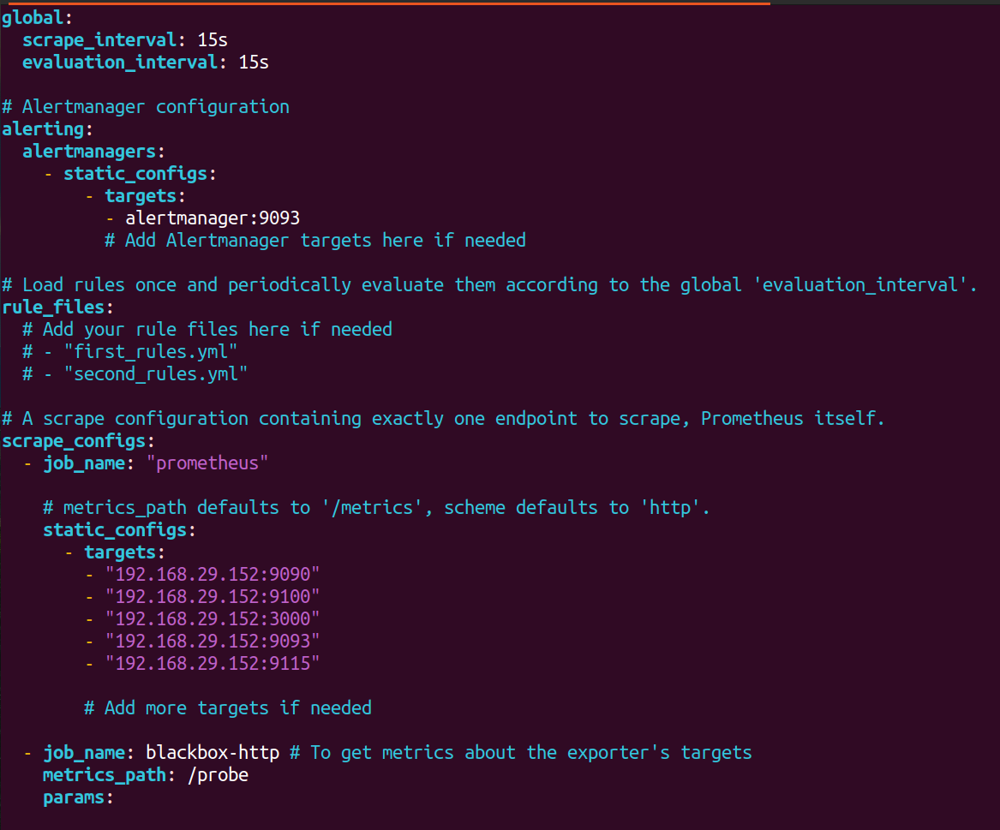
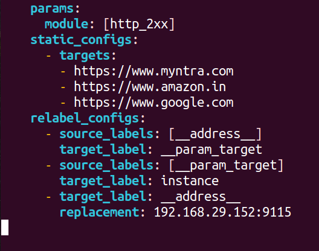

- Network IP:192.168.29.152:9115
- URL: https://www.google.com

**Step 2. Create a rules.yml file and write this code.**
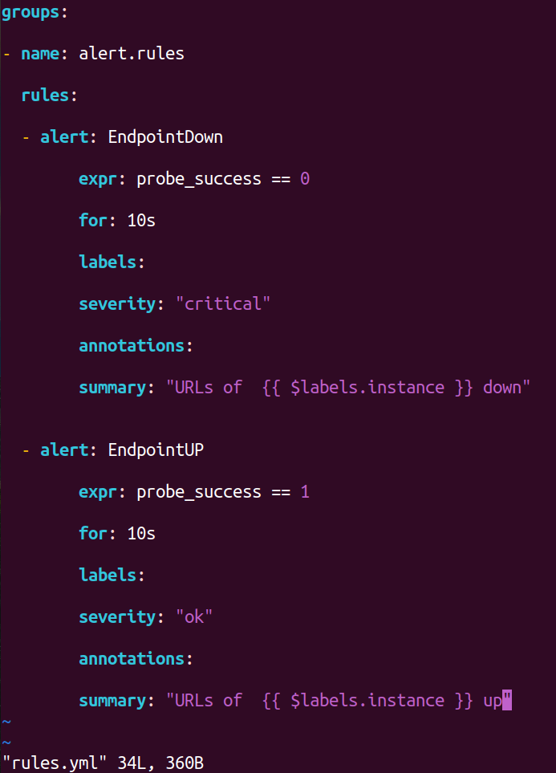

**Step 3. Run the following command in your Grafana setup to start the Podman container:**

**a. Run the prometheus.**
> - Podman run -itd -p 9090:9090 --name prometheus -v /home/himanshu/grafana/rules.yml:/etc/prometheus/rules.yml -v /home/himanshu/grafana/prometheus.yml:/etc/prometheus/prometheus.yml prom/prometheus:latest

**Podman**: Container management tool.

- **run**: Execute a container.
- **-itd**: Interactive, TTY, Detached mode.
- **-p 9090:9090**: Port mapping.
- **--name prometheus**: Assigns a name.
- **-v ...:/etc/prometheus/rules.yml**: Mounts rules.yml.
- **-v ...:/etc/prometheus/prometheus.yml**: Mounts prometheus.yml.
- **prom/prometheus:latest**: Docker image.

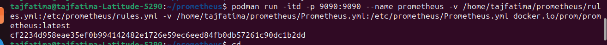

**Check**  :-  podman ps
- **pomand**: Container management.
- **ps**: List containers.

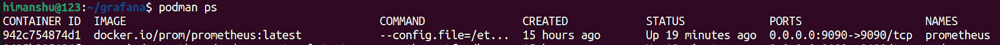
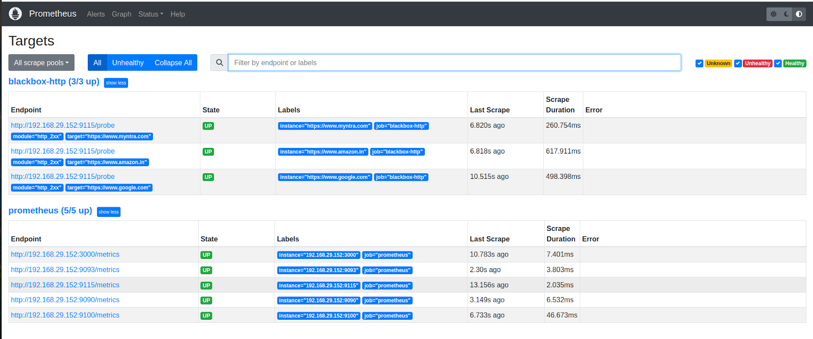

**b. Run grafana.**
> - podman run -itd --name=grafana -p 3000:3000 docker.io/grafana/grafana:8.3

- **podman**: The command itself, indicating that we are using Podman, a container management tool similar to Docker.
- **run**: Instructs Podman to run a container based on an image.
- -**itd**: These are flags that modify how the container is run:
**-i**: Keep STDIN open (interactive).
**-t**: Allocate a pseudo-TTY (terminal).
**-d**: Run the container in the background (detached).
- **--name=grafana**: Assigns the name "grafana" to the container, making it easier to manage and reference later.
- **-p 3000:3000**: Specifies port mapping, where traffic on port 3000 of the host is forwarded to port 3000 inside the container. This is commonly used for accessing services running in the container.
- **docker.io/grafana/grafana:8.3.2**: Specifies the container image to use, in this case, "grafana/grafana" version 8.3.2, retrieved from the Docker Hub repository.

**Check** :- podman ps
- **podman**: Container management.
- **ps**: List containers.

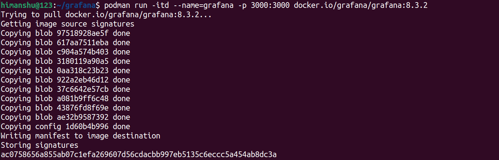
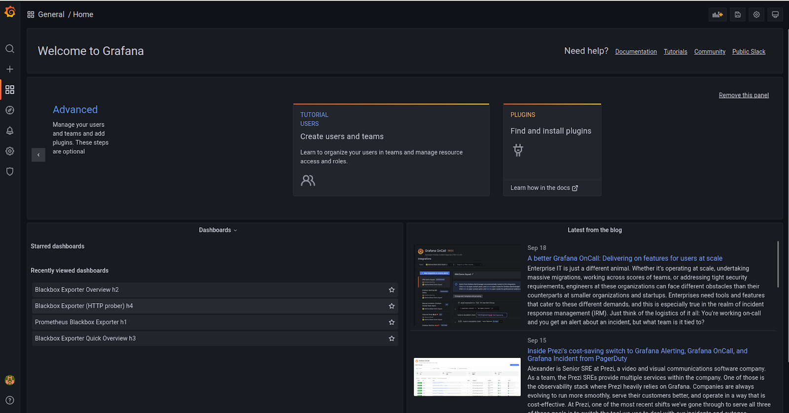

**c.  Run blackbox exporter.**
> - podman run -d --name black -p 9115:9115  bitnami/blackbox-exporter:latest

- **podman**: Container management tool.
- **run**: Start a container.
- **-d**: Run in detached mode.
- **--name black**: Assign the name "black" to the container.
- **-p 9115:9115**: Map port 9115 from host to container.
- **bitnami/blackbox-exporter:latest**: Docker image to run.

**Check** :- podman ps
- **podman**: Container management.
- **ps**: List containers.

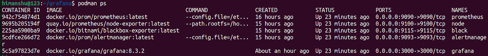

**Step 4. How do you monitor any URL and how do you configure it?**
Our team has monitored Google, Amazon, and Myntra on Grafana.

**a. We need to first put the URLs of all three in the prometheus.yml file.**

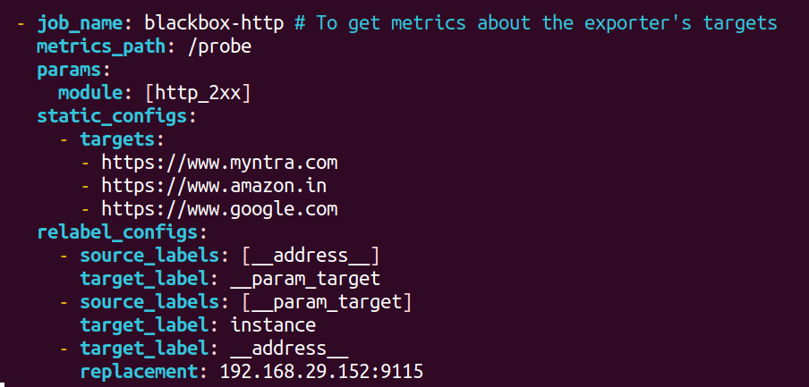

- You will need to add your own IP address in your Prometheus.yml file.

**Restart the container.** 

> - podman restart (container-id)
- podman: The command-line tool used for managing containers. It's similar to Docker.
- restart: The action to stop and then start a container.
- (container-id): Replace this with the actual ID or name of the container you want to restart.

**Check** :- podman ps
- **podman**: Container management.
- **ps**: List containers.

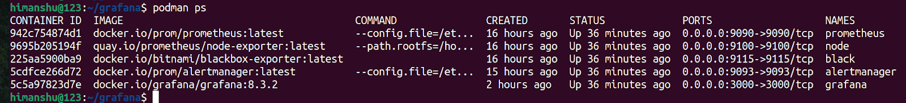

**Create a dashboard** 

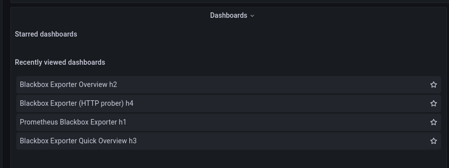

**Check prometheus**

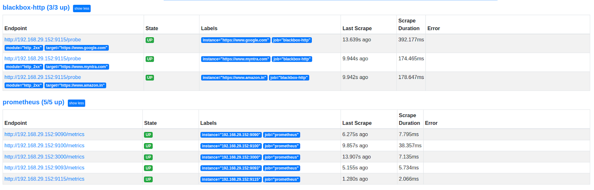

**Check blackbox exporter matrics**

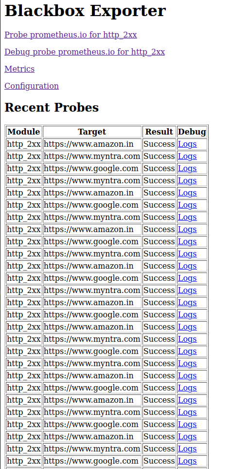

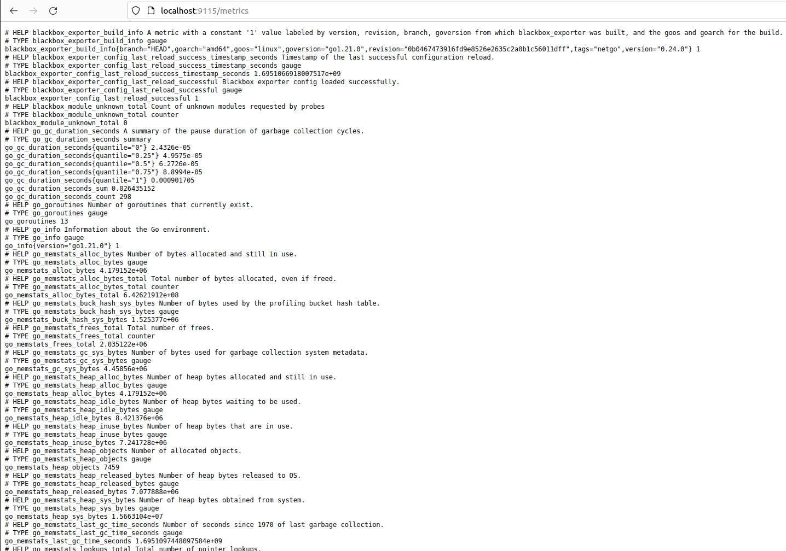

**Step 5. Now let's start monitoring in Grafana.**

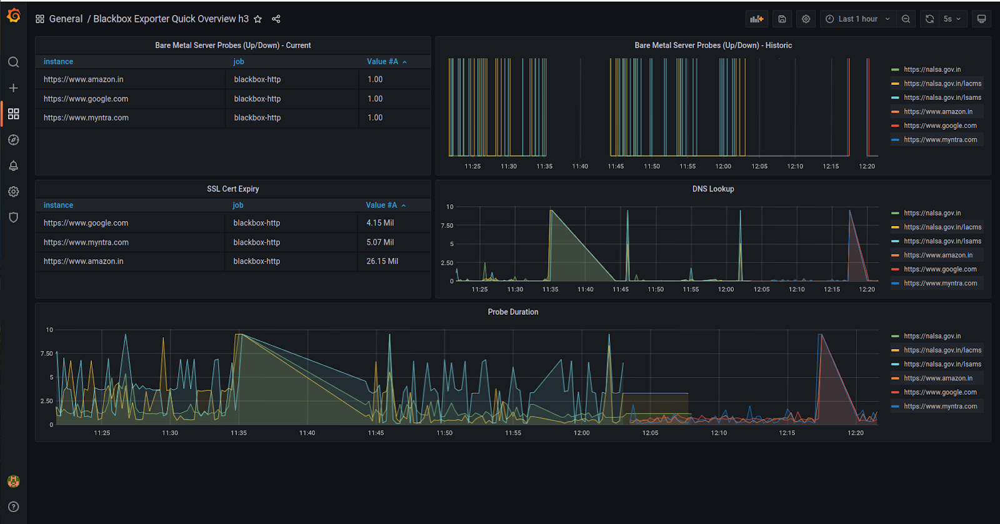

